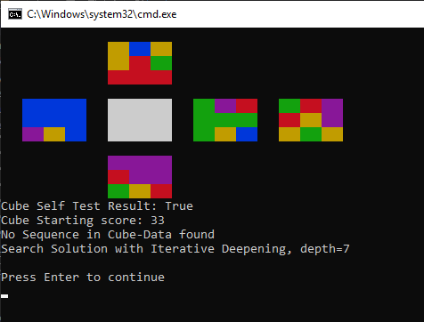
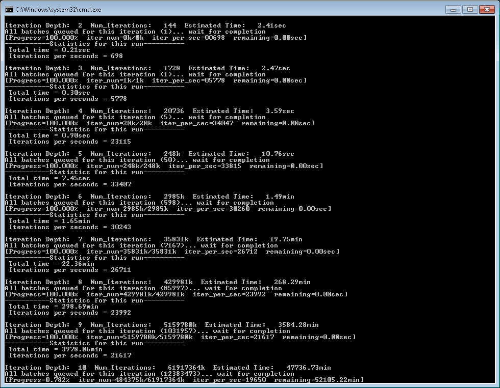

# RubiksCube
another rubiks cube project :)

## About the Author
My Background is working in an austrian electronic design company (Microtronics Eng. / https://microtronics.com/) since 2005, starting with embedded software development in ANSI-C on ARM7 MCU, going over to electronic production / assembling / service / testing and actual in embedded hardware development (PCB design). So there is widespread knowledge about embedded systems and electronics hard- and software. 
Special Thanks to my colleagues from company Saurab C. (data scientist) for sharing his machine-learning expertise, Markus S. (developer) sharing his python skills and always having some time for testing and also to my friends and family that had to listen to me when I was talking about the project (maybe sometimes too much).

## Purpose
This project was started to learn basics about machine-learning technics.
It's initial goal is to develop a ML-agent that can solve the Classic 3x3x3 Rubik's Cube.
This project should not be a copy-paste-modify (until it works) project that just uses code-snippets from other people, it is started from scratch with the intention to also improve python coding skills.
To simplify the ML, this part wil not be re-written from scratch, instead it should use a ML-framework that is capable of doing the job (e.g. tensorflow, openAIgym)

Depending on the outcome of the project and it's hardware-requirements (memory / CPU) the code should be ported to a embedded system (Microcontroller or SBC single-board-computer like RPI) that controls motors / actuators to solve the game in the real world. There is a cube solver machine that can be built with LEGO technic EV3. Control of the lego-technic-motors  without the EV3 computer is quite simple with H-Bridge circuit. I think it won't be necessary to control the motor speed with PWM so simple ON/OF for constant time should do it 
Search youtube if interested: https://www.youtube.com/watch?v=wilUgG3PjBw

The Cube was chosen as an easy "game" to improve python coding skills (modell the cube from scratch) and to learn the differences between interpreted python code to compiled C code.
Python was chosen as language as it has become a quasi-standard for machine-learning tasks.
There are reference project based on openAI Gym: https://github.com/RobinChiu/gym-Rubiks-Cube

## About Reinforecment-Learning
When talking about ML and learning-techniques there are basically 2 categories:

* supervised learning: requires a huge dataset of labeled training / validation
    typical supervised learning is done on compute-clusters of GPUs that can handle huge amount of data and train the deep-neural-networks
	the outcome is a modell-file (.h5) that can be loaded and used for classification on a machine with less computation power
	training can be continued with the .h5 file but typical it is no online training, sometimes batch training and then distribution of new .h5 file
* unsupervised learning:  requires an environment that can be observed and scoring method
    here the training is all the time. each observation will yield a score.
	The basic idea is to let somebody play a game without explaining how to play. Just give him actions and tell them how good they were.
	Maybe you heard about agents based on deep neural networks that can play atari games (e.g Pacman)

Reinforcement learning is unsupervised-learning

# Development Stages

## Rubiks Cube Environment description
Think about data representation and keep in mind that it might be ported to a resource limited embedded system. Data structures / methodes with less memory requirements are necessary.
1. define modell for Rubiks Cube data representation
1. define basic methods (rotate, print,...)
1. test basic methods (self-test)
1. load-save cube-data to files
1. addition methods as necessary:
	1. equals, score, actions

## Performance Testing (brute-force iteration)
Performance testing is necessary to get an idea how much actions can be done per second, to not end up in an scenario that would need 500 CPU years
It is already known fact the Cubes GOD-Number is 20, this means each cube can be solved in just 20 rotate actions (or less).
There are 12 basic actions, so the total number of possible iterations for 20 consecutive actions is 12^20 = 3.83*10^21 (or written as 3.83Z (zetta - SI Prefix)) 
That corresponds to 3.83Z sequences each containing 20 rotation actions.
Please note that this method is very ineffective / thumb way as there are many rotate action combinations that negotiate each other.
What we will find out with brute-force testing is how many steps we can calculate forward in acceptable time. 
This is a typical principle in tree-search problems on games (chess), to calculate some steps forward and then choose the optimal branch to progress, as it is not possible to calculate all possible playouts in acceptable time. 
1. define the iterator method and test it
1. implement a basic brute-force search for solution and test with randomly pre-rotated cubes.
1. add time / performance measurement
	find out what steps in the computation are the limiting factors
1. improve performance as much as possible
1. sum up the results of throughput and memory requirement

## Implement machine-learning 
Search for machine-learning frameworks capable of reeinforcement learning
1. search the web, choose a framework
1. Prepare Data for Machine Learning.
	when weights are computed in a (deep) neural network it is typical necessary to normalize input data to a range from 0 to 1
	sometimes preprocessing can be done from ML-framework
	processing of the neural-network output data, normal a standard minmax() 
1. implement / test the cube scoring method
1. implement / test the cube observation method (how should the data be represented to NN)
1. do basic implementation
1. just look what happens....

## optional: implement tree-searching algorithm
this is will become necessary if the machine-learning approach fails, to finish the project :)

# Actual State of Development
The Project is in the **Performance testing** Phase.
Limiting factor is the rotate() method itself of the Rubiks cube, especially the part that rodates the adjacent sides. The first implementation that is found in source code used numpy to pre-rotate the sides to align them in a uniform way for the following call of <rotate_adjacent_sides()>.
The easy solution was to introduce <rotate_simple()> that directly maps the indices in the array. This are always 12 operations for the adjacent side, 1 array rotation of the main side and with memory of 3 items.
It could be seen that "interpreted" python code behaves different then compiled C code in computation time. Compiled C code will be optimized on compilation, depeneding on how the optimizer is set, so you can write idiomatic code (for example very long switch-case), that will be reduced to very low amount of CPU instructions. In Python when you write idiomatic for loops you will note that this is quite slower then using list-comprehension methodolgy. The result is the same, but the list comprehension is typical faster. 

With a Starting performance of ~2k iterations/sec (single-process / single CPU) and after optimization the highest number was about 60k iterations/sec 
This was archived using i9 9900k CPU @ 4.4GHz Overclocked constant frequency (8-core with HT), utilized with 15 parallel processes computing iterations and 1 Process for managing. Iteration batch size was chosen so that 1 batch completes in approx 1 second.
As this CPU utilization results in a high amount of electrical Power and very HOT CPU (above 70°C) it cannot be held for a long time.
So it was limited to approx 20k iterations per sec.

The actual memory occupancy is quite low for a windows based program:
  17.4MB for main.py
  17.4MB * 16 = 278.4MB for main_multiprocessing.py
With that numbers a distribution to embedded linux system would be possible, if all required python packages are available.
Distributing to a microcontroller (ARM Cortex M) is not possible, they are typical limited to less then 4MB of RAM and 2MB of CODE Memory
For that goal we need to re-write it in C language for Microcontroller. With the choosen data-structure it should be possible to represent the cube in 54Byte RAM, with potential going down to 24 bytes if we use 3 bits for color index instead of 1 byte. At that point it should be said that working on bit level with shifting instructions is typical slower then working on "word" aligned data, so better spend some more of RAM memory if you can afford it. Maybe working with nibbles of 4 Bit per color index could be a good idea on MCU system.
Please also note that on 32Bit MCU the addition of int32 values is typical faster then the addition of int8 or int16, as int32 are aligned to 4byte boundaries, while int8 are aligned to 1 byte boundaries and first must be mapped to 4-byte boundaries. Here you can decide between computation speed and memory requirements

Maybe its possible to use MicroPython for STM32? If someone has experience please share.

From my experience with tensorflow and keras introducing a deep-convolutional-neural-network (CNN) increases the memory requirement according to the NN complexity.
With complex models this can be some 100MB's for evaluating and during training some 1000MBs according to the batch-size.

I have no idea about the requirments for reinforcement learning models

# How to help
just spend some time reading the code, tell me what you think about it - what is good oder bad code.

If you are interested in the project or the result: Feel free to contact me, share your ideas / knowledge 

If you have some time: test it, change some parameters, tell me what did not work as expected
(I know the colored console output looks different on other machine or python interpreter)

If you have much time: ... there will be info about known bugs and next steps to work on. just do it :) 

