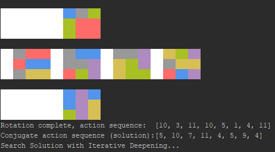

# RubiksCube Info File for source

src folder contains main and sub .py files
all main are intended to run and do their specific action
* main_bruteforce: is searching for a solution by brute-force attack on the cube in single processing, test of the bruteforce method and the iterator
* main_bruteforce_multiproc: is searching for a solution by brute-force attack on the cube, using multprocessing to utilize new multicore CPU
* main_classic_solver.py: simple solver to be controlled manually
* main_torch_crossentropy.py: pytorch trial

main are identified by filename starting with "main_"
all other are submodules
each submodule has a main() method that can be used to test for their specific methods

there is subfolder "gym" - containing openAI gym environment, to be included as a python package
pip_install_package.bat will install the python package using pip
you only need to do this once

# Requirements
This project is developed using *Visual Studio 2019 - Community* Edition
Python Interpreter 3.x is required. It is developed on 3.7 and tested on 3.6
only *numpy* is required at the moment, all other used packages are installed with the python interpreter
Windows 10 would be good as you have colored console output
pytorch, gym and tensorboard are tools for reeinforcement learning
the gym environment uses graphical rendering, like other classic environments have (e.g. cartpole)

# about the Console Output
The output on the console is using ANSI ESC with CSI format strings.
you can read about that here: https://en.wikipedia.org/wiki/ANSI_escape_code#Escape_sequences

## Short description
well known ESC-Codes are for example "\n" or "\r"  - LF (line feed) and CR (carriage reset)
beside that there are other. Here the "\x1b" is used, this code is called ESC (dez 27 or octal 33)
After the ESC an "[" is sent to introduce a control sequence (CSI)
after the parameters are sent setting <style>, <fg-col>, and <bg-col>
we can stack parameters by seperating them with ";" > we can pass fg and bg color attribute in a single format string
be aware that we can stack multiple styles (eg. bold + italic)
therefore it would be good to reset the rendition style after formatted-string-end with "\x1b[0m" to defaults
from the 1979 ANSI spec: '[30m = Write with black,  [40m = Set background to black (GIGI)'
after the last parameter we terminate with "m" it tells that control sequence is SGR (set graphics rendition)
examples for used format strings (ESC+CSI+<SGR-parameters>+"m")
' col_str_black   = "\x1b[0;30;40m" '
' col_str_end     = "\x1b[0m" '

# Known Issues
## console output looks weird
The colored console output relies on a command interpreter capable of it. This is called *VT100 Terminal Emulation* or Virtual Terminal.
Python is always launched from a command interpreter, typical cmd.exe or powershell.exe in windows. Linux based systems have usual no problem with that as there shells have always been using colors.
If the interpreter cannot handle it, it will look like this when 'print_2d()' is called:
                        
                        
                        
"" is the ESC, it has no ASCII character

On Microsoft Systems:
* Older then Windows 7 ansi.sys could be used for that (but has not been tested)
* On Windows 7 the interpreter doesn't have VT100 emulation, and there seems to be no way to enable ansi.sys. Some people write there are tools that would enable Terminal emulation on the interpreter but it was not tested.
* On Windows 10 the interpreter can handle VT100, but sometimes it is turned of. You can change it by editing a key in the registry.

Sometimes the IDE brings its own interpreter with VT100 terminal emulation, like pycharm. Different interpreters use sometimes different colors - so the output will be colored but may look weird.
Sometimes it could happen that default fg / bg color have been changed. this would also cause the output to look weird. You change that by simply open the properties tab of the interpreter and reset window bg to black and text fg to white. It will be remembered.

print_2d() changes the bg-color and then just prints spaces to plot the cube.
for simplicity reasons 'def _print_blocks(self, col_idx, num_blocks)' was introduced. 
on the first line the first colored output is at position 15, so 15 spaces are inserted with bg set to black.
with default black bg on the console they are not visible to you. Sometimes the colstr for black does not create black, so it looks also weird
a better solution would be to print the spaces over the whole region and also for the seperator between back / middle / front

For compatibility with noncolor command interpreters there should be an alternative text based output similar to ASCII table.
Maybe it is possible to get the console mode in python and select the output mode to text or VT100

